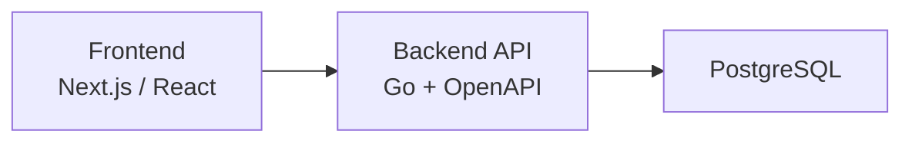
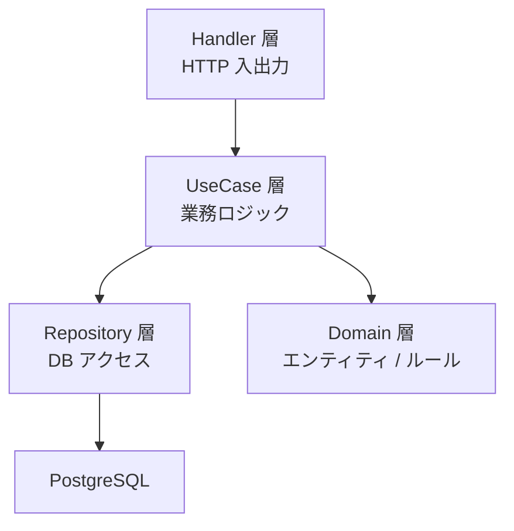
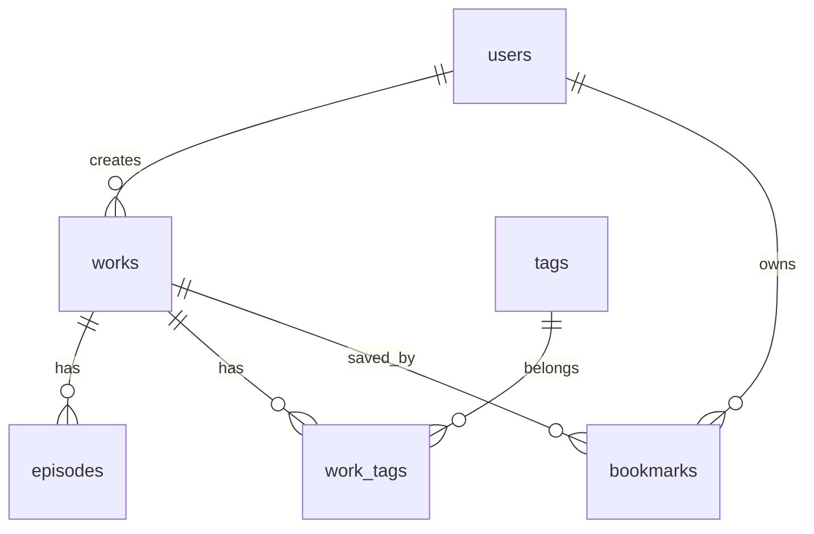
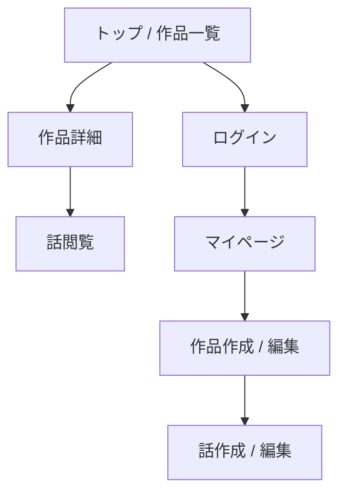

# 小説投稿プラットフォーム 設計書

## 1. 目的

本プロジェクトは、学生の演習として「カクヨム」や「小説家になろう」のような小説投稿サイトを小規模に実装することを目的とする。

設計上は、以下を重視する。

- 小規模でも完成まで持っていきやすいこと
- 機能追加しやすい構成であること
- バックエンドを Go で実装しやすいこと
- API 契約を OpenAPI で明確に管理できること

---

## 2. システム概要

### 2.1 想定するサービス内容

ユーザーがアカウントを作成し、小説作品を投稿し、各話を追加し、他ユーザーが閲覧できる Web サービスを提供する。

### 2.2 MVP で扱う機能

演習プロジェクトとして、まずは以下を最小実装範囲とする。

- ユーザー登録
- ログイン / ログアウト
- 小説作品の作成
- 小説作品の編集
- 話の追加 / 編集
- 公開作品一覧の閲覧
- 作品詳細の閲覧
- 各話本文の閲覧
- タグ付け
- ブックマーク

### 2.3 MVP で扱わない機能

以下は拡張候補とし、初期実装の対象外とする。

- 高度なランキング
- 通知機能
- コメント機能
- レビュー機能
- 全文検索
- 推薦アルゴリズム
- 管理画面の高度化

---

## 3. 採用技術

### 3.1 バックエンド

- 言語: Go
- API 仕様: OpenAPI 3.x
- HTTP ルーティング: `chi`
- OpenAPI コード生成: `oapi-codegen`
- DB 接続: `pgx`
- マイグレーション: `goose`
- 認証: JWT
- テスト: `testify`

### 3.2 フロントエンド

- Next.js または React + Vite
- バックエンド API を OpenAPI ベースで利用

### 3.3 データベース

- PostgreSQL

### 3.4 開発環境

- Docker Compose
- Git / GitHub

---

## 4. 全体アーキテクチャ

小規模演習としては、マイクロサービスではなく **モノリシックな Web アプリケーション** を採用する。

理由は以下の通り。

- 実装対象を 1 プロセスにまとめられる
- デバッグしやすい
- OpenAPI と Go の学習に集中できる
- 学生プロジェクトの開発期間に対して適切な複雑さに収まる

### 4.1 構成図



### 4.2 バックエンド内部の責務分離

バックエンドは、以下の 4 層に分ける。



各層の責務は次の通り。

- Handler 層
  - HTTP リクエスト受信
  - パラメータ検証
  - レスポンス整形
  - OpenAPI 生成コードとの接続
- UseCase 層
  - アプリケーション固有の業務ロジック
  - 認可判定
  - 複数 Repository の組み合わせ
- Repository 層
  - SQL 実行
  - DB レコードの永続化 / 取得
- Domain 層
  - `User`, `Work`, `Episode` などの概念定義
  - 業務上の不変条件の表現

---

## 5. 機能設計

### 5.1 ユーザー

- 新規登録
- ログイン
- 自分のプロフィール取得

### 5.2 作品

- 作品作成
- タイトル / あらすじ / 公開状態の編集
- 作品一覧取得
- 作品詳細取得

### 5.3 話

- 話の追加
- 話タイトル / 本文の編集
- 話順の管理
- 各話の閲覧

### 5.4 タグ

- 作品にタグを付与
- 作品詳細でタグ表示

### 5.5 ブックマーク

- 作品のブックマーク追加
- ブックマーク解除
- 自分のブックマーク一覧取得

---

## 6. API 設計方針

本プロジェクトは **contract-first** で進める。  
先に OpenAPI で API 契約を定義し、その後 Go のハンドラ実装とフロントエンド連携を進める。

### 6.1 設計方針

- URI はリソース指向で設計する
- OpenAPI を API の正本とする
- 入出力 DTO とドメインモデルを分離する
- 公開 API と認証必須 API を明確に分ける

### 6.2 主なエンドポイント

#### 認証

- `POST /auth/register`
- `POST /auth/login`
- `GET /me`

#### 公開作品

- `GET /works`
- `GET /works/{workId}`
- `GET /works/{workId}/episodes/{episodeId}`

#### 認証必須

- `POST /works`
- `PATCH /works/{workId}`
- `POST /works/{workId}/episodes`
- `PATCH /works/{workId}/episodes/{episodeId}`
- `POST /works/{workId}/bookmark`
- `DELETE /works/{workId}/bookmark`
- `GET /me/bookmarks`

### 6.3 OpenAPI 運用イメージ

1. `openapi.yaml` を更新する
2. `oapi-codegen` で Go の型やインタフェースを生成する
3. 生成されたインタフェースを満たす形で Handler を実装する
4. フロントエンドから API を呼び出す

この流れにより、バックエンドとフロントエンドの認識ずれを減らす。

---

## 7. データ設計

### 7.1 テーブル一覧

- `users`
- `works`
- `episodes`
- `tags`
- `work_tags`
- `bookmarks`

### 7.2 ER 図



### 7.3 主要テーブル項目

#### users

- `id`
- `name`
- `email`
- `password_hash`
- `created_at`
- `updated_at`

#### works

- `id`
- `author_id`
- `title`
- `summary`
- `status`
- `is_public`
- `created_at`
- `updated_at`

`status` は以下を想定する。

- `draft`
- `ongoing`
- `completed`

#### episodes

- `id`
- `work_id`
- `episode_no`
- `title`
- `body`
- `created_at`
- `updated_at`

#### tags

- `id`
- `name`

#### work_tags

- `work_id`
- `tag_id`

#### bookmarks

- `user_id`
- `work_id`
- `created_at`

### 7.4 制約

- `users.email` は一意
- `tags.name` は一意
- `episodes` は `work_id + episode_no` を一意にする
- `bookmarks` は `user_id + work_id` を一意にする

---

## 8. 認証・認可

### 8.1 認証方式

JWT ベース認証を採用する。

- ログイン成功時にアクセストークンを発行
- 認証必須 API は `Authorization: Bearer <token>` を要求

### 8.2 認可ルール

- 作品編集は作品作成者のみ可能
- 話編集は対象作品の作成者のみ可能
- 非公開作品は作成者以外閲覧不可
- ブックマークはログインユーザー本人のみ操作可能

### 8.3 演習としての実装簡略化

初期段階では以下の簡略化を認める。

- リフレッシュトークンは導入しない
- 権限ロールは一般ユーザーのみ
- メール認証は導入しない

---

## 9. バックエンドのディレクトリ構成案

```text
backend/
  cmd/
    api/
      main.go
  internal/
    domain/
    usecase/
    repository/
    handler/
    middleware/
    gen/
  openapi/
    openapi.yaml
  migrations/
  Makefile
```

### 9.1 各ディレクトリの役割

- `cmd/api`
  - アプリケーション起動処理
- `internal/domain`
  - エンティティ、値オブジェクト、ルール
- `internal/usecase`
  - 業務ロジック
- `internal/repository`
  - PostgreSQL へのアクセス処理
- `internal/handler`
  - HTTP ハンドラ
- `internal/middleware`
  - 認証、ロギング、CORS など
- `internal/gen`
  - OpenAPI 生成コード
- `openapi`
  - API 契約ファイル
- `migrations`
  - DB マイグレーション

---

## 10. フロントエンド構成案

フロントエンドは以下の画面を最小構成とする。

- ログイン画面
- ユーザー登録画面
- 作品一覧画面
- 作品詳細画面
- 話閲覧画面
- マイページ
- 作品作成 / 編集画面
- 話作成 / 編集画面

### 10.1 画面遷移イメージ



---

## 11. 非機能要件

### 11.1 保守性

- OpenAPI を API の単一情報源にする
- レイヤ分離により変更影響を局所化する
- 役割単位でパッケージを分離する

### 11.2 拡張性

以下の機能を将来的に追加しやすい構成とする。

- コメント
- レビュー
- ランキング
- お知らせ
- 検索
- 通知

### 11.3 セキュリティ

- パスワードはハッシュ化して保存する
- JWT 検証をミドルウェアで統一する
- 入力バリデーションを OpenAPI と Handler 双方で行う

---

## 12. エラーハンドリング方針

### 12.1 HTTP ステータス

- `200 OK`: 取得成功
- `201 Created`: 作成成功
- `400 Bad Request`: バリデーションエラー
- `401 Unauthorized`: 未認証
- `403 Forbidden`: 権限なし
- `404 Not Found`: 対象なし
- `409 Conflict`: 重複や競合
- `500 Internal Server Error`: サーバ内部エラー

### 12.2 エラーレスポンス例

```json
{
  "code": "VALIDATION_ERROR",
  "message": "title is required"
}
```

エラー形式を統一することで、フロントエンド実装を簡単にする。

---

## 13. テスト方針

### 13.1 バックエンド

- UseCase の単体テスト
- Repository の結合テスト
- Handler の API テスト

### 13.2 フロントエンド

- 主要画面の表示確認
- フォーム送信確認
- API エラー時の表示確認

### 13.3 演習での優先順位

時間が限られるため、以下を優先する。

1. 認証
2. 作品作成
3. 話投稿
4. 閲覧 API

---

## 14. 開発・運用構成

### 14.1 Docker Compose 構成

- `frontend`
- `backend`
- `db`

### 14.2 開発フロー

1. OpenAPI 定義を更新
2. コード生成
3. Handler / UseCase / Repository 実装
4. フロントエンド画面実装
5. テスト

---

## 15. 今後の拡張案

- コメント投稿機能
- レビュー投稿機能
- 作品ランキング
- お気に入りユーザー機能
- タグ検索
- 全文検索
- 管理者機能

---

## 16. 演習プロジェクトとしてのまとめ

本設計は、小説投稿サイトとして必要な基本要素を押さえつつ、学生の演習で実装可能な規模に絞った構成である。

特に以下の点が教育的に有効である。

- REST API 設計を OpenAPI で明文化できる
- Go による層分離の考え方を学べる
- DB 設計と Web API の対応関係を理解しやすい
- 将来の拡張を見据えた設計判断を体験できる

まずは MVP を確実に完成させ、その後にコメントやランキングなどを追加する段階的開発を推奨する。
